## Class and Flow diagram of the interactions

Services and objects:

```mermaid
classDiagram

class RP {
    <<service>>
    createAuthenticationRequest(opts?) Promise(AuthenticationRequestURI)
    verifyAuthenticationResponseJwt(jwt: string, opts?) Promise(VerifiedAuthenticationResponseWithJWT)
}
RP --> AuthenticationRequestURI
RP --> VerifiedAuthenticationResponseWithJWT
RP --> AuthenticationRequest
RP --> AuthenticationResponse

class OP {
    <<service>>
    createAuthenticationResponse(jwtOrUri: string, opts?) Promise(AuthenticationResponseWithJWT)
    verifyAuthenticationRequest(jwt: string, opts?) Promise(VerifiedAuthenticationRequestWithJWT)
}
OP --> AuthenticationResponseWithJWT
OP --> VerifiedAuthenticationRequestWithJWT
OP --> AuthenticationRequest
OP --> AuthenticationResponse


class AuthenticationRequestOpts {
  <<interface>>
  redirectUri: string;
  requestBy: ObjectBy;
  signatureType: InternalSignature | ExternalSignature | NoSignature;
  responseMode?: ResponseMode;
  claims?: OidcClaim;
  registration: RequestRegistrationOpts;
  nonce?: string;
  state?: string;
}
AuthenticationRequestOpts --> ResponseMode
AuthenticationRequestOpts --> RPRegistrationMetadataOpts



class RPRegistrationMetadataOpts {
  <<interface>>
  subjectIdentifiersSupported: SubjectIdentifierType[] | SubjectIdentifierType;
  didMethodsSupported?: string[] | string;
  credentialFormatsSupported: CredentialFormat[] | CredentialFormat;
}

class RequestRegistrationOpts {
  <<interface>>
  registrationBy: RegistrationType;
}
RequestRegistrationOpts --|> RPRegistrationMetadataOpts


class VerifyAuthenticationRequestOpts {
  <<interface>>
  verification: InternalVerification | ExternalVerification;
  nonce?: string;
}

class AuthenticationRequest {
    <<service>>
    createURI(opts: AuthenticationRequestOpts) Promise(AuthenticationRequestURI)
    createJWT(opts: AuthenticationRequestOpts) Promise(AuthenticationRequestWithJWT);
    verifyJWT(jwt: string, opts: VerifyAuthenticationRequestOpts) Promise(VerifiedAuthenticationRequestWithJWT)
}
AuthenticationRequest <-- AuthenticationRequestOpts
AuthenticationRequest <-- VerifyAuthenticationRequestOpts
AuthenticationRequest --> AuthenticationRequestURI
AuthenticationRequest --> AuthenticationRequestWithJWT
AuthenticationRequest --> VerifiedAuthenticationRequestWithJWT

class AuthenticationResponse {
  <<interface>>
  createJWTFromRequestJWT(jwt: string, responseOpts: AuthenticationResponseOpts, verifyOpts: VerifyAuthenticationRequestOpts) Promise(AuthenticationResponseWithJWT)
  verifyJWT(jwt: string, verifyOpts: VerifyAuthenticationResponseOpts) Promise(VerifiedAuthenticationResponseWithJWT)
}
AuthenticationResponse <-- AuthenticationResponseOpts
AuthenticationResponse <-- VerifyAuthenticationRequestOpts
AuthenticationResponse --> AuthenticationResponseWithJWT
AuthenticationResponse <-- VerifyAuthenticationResponseOpts
AuthenticationResponse --> VerifiedAuthenticationResponseWithJWT

class AuthenticationResponseOpts {
  <<interface>>
  signatureType: InternalSignature | ExternalSignature;
  nonce?: string;
  state?: string;
  registration: ResponseRegistrationOpts;
  responseMode?: ResponseMode;
  did: string;
  vp?: VerifiablePresentation;
  expiresIn?: number;
}
AuthenticationResponseOpts --> ResponseMode

class AuthenticationResponseWithJWT {
  <<interface>>
  jwt: string;
  nonce: string;
  state: string;
  payload: AuthenticationResponsePayload;
  verifyOpts?: VerifyAuthenticationRequestOpts;
  responseOpts: AuthenticationResponseOpts;
}
AuthenticationResponseWithJWT --> AuthenticationResponsePayload
AuthenticationResponseWithJWT --> VerifyAuthenticationRequestOpts
AuthenticationResponseWithJWT --> AuthenticationResponseOpts


class VerifyAuthenticationResponseOpts {
  <<interface>>
  verification: InternalVerification | ExternalVerification;
  nonce?: string;
  state?: string;
  audience: string;
}

class ResponseMode {
    <<enum>>
}

 class UriResponse {
    <<interface>>
    responseMode?: ResponseMode;
    bodyEncoded?: string;
}
UriResponse --> ResponseMode
UriResponse <|-- SIOPURI

class SIOPURI {
    <<interface>>
    encodedUri: string;
    encodingFormat: UrlEncodingFormat;
}
SIOPURI --> UrlEncodingFormat
SIOPURI <|-- AuthenticationRequestURI

class AuthenticationRequestURI {
  <<interface>>
  jwt?: string; 
  requestOpts: AuthenticationRequestOpts;
  requestPayload: AuthenticationRequestPayload;
}
AuthenticationRequestURI --> AuthenticationRequestPayload

class UrlEncodingFormat {
    <<enum>>
}

class ResponseMode {
  <<enum>>
}

class AuthenticationRequestPayload {
    <<interface>>
    scope: Scope;
    response_type: ResponseType;
    client_id: string;
    redirect_uri: string;
    response_mode: ResponseMode;
    request: string;
    request_uri: string;
    state?: string;
    nonce: string;
    did_doc?: DIDDocument;
    claims?: RequestClaims;
}
AuthenticationRequestPayload --|> JWTPayload

class  JWTPayload {
  iss?: string
  sub?: string
  aud?: string | string[]
  iat?: number
  nbf?: number
  exp?: number
  rexp?: number
  [x: string]: any
}


class VerifiedAuthenticationRequestWithJWT {
  <<interface>>
  payload: AuthenticationRequestPayload; 
  verifyOpts: VerifyAuthenticationRequestOpts; 
}
VerifiedJWT <|-- VerifiedAuthenticationRequestWithJWT
VerifiedAuthenticationRequestWithJWT --> VerifyAuthenticationRequestOpts
VerifiedAuthenticationRequestWithJWT --> AuthenticationRequestPayload

class VerifiedAuthenticationResponseWithJWT {
  <<interface>>
  payload: AuthenticationResponsePayload;
  verifyOpts: VerifyAuthenticationResponseOpts;
}
VerifiedAuthenticationResponseWithJWT --> AuthenticationResponsePayload
VerifiedAuthenticationResponseWithJWT --> VerifyAuthenticationResponseOpts
VerifiedJWT <|-- VerifiedAuthenticationResponseWithJWT

class VerifiedJWT {
  <<interface>>
  payload: Partial<JWTPayload>;
  didResolutionResult: DIDResolutionResult;
  issuer: string;
  signer: VerificationMethod;
  jwt: string;
}
```

[](https://mermaid-js.github.io/mermaid-live-editor/edit#eyJjb2RlIjoiY2xhc3NEaWFncmFtXG5cbmNsYXNzIFJQIHtcbiAgICA8PHNlcnZpY2U-PlxuICAgIGNyZWF0ZUF1dGhlbnRpY2F0aW9uUmVxdWVzdChvcHRzPykgUHJvbWlzZShBdXRoZW50aWNhdGlvblJlcXVlc3RVUkkpXG4gICAgdmVyaWZ5QXV0aGVudGljYXRpb25SZXNwb25zZUp3dChqd3Q6IHN0cmluZywgb3B0cz8pIFByb21pc2UoVmVyaWZpZWRBdXRoZW50aWNhdGlvblJlc3BvbnNlV2l0aEpXVClcbn1cblJQIC0tPiBBdXRoZW50aWNhdGlvblJlcXVlc3RVUklcblJQIC0tPiBWZXJpZmllZEF1dGhlbnRpY2F0aW9uUmVzcG9uc2VXaXRoSldUXG5SUCAtLT4gQXV0aGVudGljYXRpb25SZXF1ZXN0XG5SUCAtLT4gQXV0aGVudGljYXRpb25SZXNwb25zZVxuXG5jbGFzcyBPUCB7XG4gICAgPDxzZXJ2aWNlPj5cbiAgICBjcmVhdGVBdXRoZW50aWNhdGlvblJlc3BvbnNlKGp3dE9yVXJpOiBzdHJpbmcsIG9wdHM_KSBQcm9taXNlKEF1dGhlbnRpY2F0aW9uUmVzcG9uc2VXaXRoSldUKVxuICAgIHZlcmlmeUF1dGhlbnRpY2F0aW9uUmVxdWVzdChqd3Q6IHN0cmluZywgb3B0cz8pIFByb21pc2UoVmVyaWZpZWRBdXRoZW50aWNhdGlvblJlcXVlc3RXaXRoSldUKVxufVxuT1AgLS0-IEF1dGhlbnRpY2F0aW9uUmVzcG9uc2VXaXRoSldUXG5PUCAtLT4gVmVyaWZpZWRBdXRoZW50aWNhdGlvblJlcXVlc3RXaXRoSldUXG5PUCAtLT4gQXV0aGVudGljYXRpb25SZXF1ZXN0XG5PUCAtLT4gQXV0aGVudGljYXRpb25SZXNwb25zZVxuXG5cbmNsYXNzIEF1dGhlbnRpY2F0aW9uUmVxdWVzdE9wdHMge1xuICA8PGludGVyZmFjZT4-XG4gIHJlZGlyZWN0VXJpOiBzdHJpbmc7XG4gIHJlcXVlc3RCeTogT2JqZWN0Qnk7XG4gIHNpZ25hdHVyZVR5cGU6IEludGVybmFsU2lnbmF0dXJlIHwgRXh0ZXJuYWxTaWduYXR1cmUgfCBOb1NpZ25hdHVyZTtcbiAgcmVzcG9uc2VNb2RlPzogUmVzcG9uc2VNb2RlO1xuICBjbGFpbXM_OiBPaWRjQ2xhaW07XG4gIHJlZ2lzdHJhdGlvbjogUmVxdWVzdFJlZ2lzdHJhdGlvbk9wdHM7XG4gIG5vbmNlPzogc3RyaW5nO1xuICBzdGF0ZT86IHN0cmluZztcbn1cbkF1dGhlbnRpY2F0aW9uUmVxdWVzdE9wdHMgLS0-IFJlc3BvbnNlTW9kZVxuQXV0aGVudGljYXRpb25SZXF1ZXN0T3B0cyAtLT4gUlBSZWdpc3RyYXRpb25NZXRhZGF0YU9wdHNcblxuXG5cbmNsYXNzIFJQUmVnaXN0cmF0aW9uTWV0YWRhdGFPcHRzIHtcbiAgPDxpbnRlcmZhY2U-PlxuICBzdWJqZWN0SWRlbnRpZmllcnNTdXBwb3J0ZWQ6IFN1YmplY3RJZGVudGlmaWVyVHlwZVtdIHwgU3ViamVjdElkZW50aWZpZXJUeXBlO1xuICBkaWRNZXRob2RzU3VwcG9ydGVkPzogc3RyaW5nW10gfCBzdHJpbmc7XG4gIGNyZWRlbnRpYWxGb3JtYXRzU3VwcG9ydGVkOiBDcmVkZW50aWFsRm9ybWF0W10gfCBDcmVkZW50aWFsRm9ybWF0O1xufVxuXG5jbGFzcyBSZXF1ZXN0UmVnaXN0cmF0aW9uT3B0cyB7XG4gIDw8aW50ZXJmYWNlPj5cbiAgcmVnaXN0cmF0aW9uQnk6IFJlZ2lzdHJhdGlvblR5cGU7XG59XG5SZXF1ZXN0UmVnaXN0cmF0aW9uT3B0cyAtLXw-IFJQUmVnaXN0cmF0aW9uTWV0YWRhdGFPcHRzXG5cblxuY2xhc3MgVmVyaWZ5QXV0aGVudGljYXRpb25SZXF1ZXN0T3B0cyB7XG4gIDw8aW50ZXJmYWNlPj5cbiAgdmVyaWZpY2F0aW9uOiBJbnRlcm5hbFZlcmlmaWNhdGlvbiB8IEV4dGVybmFsVmVyaWZpY2F0aW9uO1xuICBub25jZT86IHN0cmluZztcbn1cblxuY2xhc3MgQXV0aGVudGljYXRpb25SZXF1ZXN0IHtcbiAgICA8PHNlcnZpY2U-PlxuICAgIGNyZWF0ZVVSSShvcHRzOiBBdXRoZW50aWNhdGlvblJlcXVlc3RPcHRzKSBQcm9taXNlKEF1dGhlbnRpY2F0aW9uUmVxdWVzdFVSSSlcbiAgICBjcmVhdGVKV1Qob3B0czogQXV0aGVudGljYXRpb25SZXF1ZXN0T3B0cykgUHJvbWlzZShBdXRoZW50aWNhdGlvblJlcXVlc3RXaXRoSldUKTtcbiAgICB2ZXJpZnlKV1Qoand0OiBzdHJpbmcsIG9wdHM6IFZlcmlmeUF1dGhlbnRpY2F0aW9uUmVxdWVzdE9wdHMpIFByb21pc2UoVmVyaWZpZWRBdXRoZW50aWNhdGlvblJlcXVlc3RXaXRoSldUKVxufVxuQXV0aGVudGljYXRpb25SZXF1ZXN0IDwtLSBBdXRoZW50aWNhdGlvblJlcXVlc3RPcHRzXG5BdXRoZW50aWNhdGlvblJlcXVlc3QgPC0tIFZlcmlmeUF1dGhlbnRpY2F0aW9uUmVxdWVzdE9wdHNcbkF1dGhlbnRpY2F0aW9uUmVxdWVzdCAtLT4gQXV0aGVudGljYXRpb25SZXF1ZXN0VVJJXG5BdXRoZW50aWNhdGlvblJlcXVlc3QgLS0-IEF1dGhlbnRpY2F0aW9uUmVxdWVzdFdpdGhKV1RcbkF1dGhlbnRpY2F0aW9uUmVxdWVzdCAtLT4gVmVyaWZpZWRBdXRoZW50aWNhdGlvblJlcXVlc3RXaXRoSldUXG5cbmNsYXNzIEF1dGhlbnRpY2F0aW9uUmVzcG9uc2Uge1xuICA8PGludGVyZmFjZT4-XG4gIGNyZWF0ZUpXVEZyb21SZXF1ZXN0SldUKGp3dDogc3RyaW5nLCByZXNwb25zZU9wdHM6IEF1dGhlbnRpY2F0aW9uUmVzcG9uc2VPcHRzLCB2ZXJpZnlPcHRzOiBWZXJpZnlBdXRoZW50aWNhdGlvblJlcXVlc3RPcHRzKSBQcm9taXNlKEF1dGhlbnRpY2F0aW9uUmVzcG9uc2VXaXRoSldUKVxuICB2ZXJpZnlKV1Qoand0OiBzdHJpbmcsIHZlcmlmeU9wdHM6IFZlcmlmeUF1dGhlbnRpY2F0aW9uUmVzcG9uc2VPcHRzKSBQcm9taXNlKFZlcmlmaWVkQXV0aGVudGljYXRpb25SZXNwb25zZVdpdGhKV1QpXG59XG5BdXRoZW50aWNhdGlvblJlc3BvbnNlIDwtLSBBdXRoZW50aWNhdGlvblJlc3BvbnNlT3B0c1xuQXV0aGVudGljYXRpb25SZXNwb25zZSA8LS0gVmVyaWZ5QXV0aGVudGljYXRpb25SZXF1ZXN0T3B0c1xuQXV0aGVudGljYXRpb25SZXNwb25zZSAtLT4gQXV0aGVudGljYXRpb25SZXNwb25zZVdpdGhKV1RcbkF1dGhlbnRpY2F0aW9uUmVzcG9uc2UgPC0tIFZlcmlmeUF1dGhlbnRpY2F0aW9uUmVzcG9uc2VPcHRzXG5BdXRoZW50aWNhdGlvblJlc3BvbnNlIC0tPiBWZXJpZmllZEF1dGhlbnRpY2F0aW9uUmVzcG9uc2VXaXRoSldUXG5cbmNsYXNzIEF1dGhlbnRpY2F0aW9uUmVzcG9uc2VPcHRzIHtcbiAgPDxpbnRlcmZhY2U-PlxuICBzaWduYXR1cmVUeXBlOiBJbnRlcm5hbFNpZ25hdHVyZSB8IEV4dGVybmFsU2lnbmF0dXJlO1xuICBub25jZT86IHN0cmluZztcbiAgc3RhdGU_OiBzdHJpbmc7XG4gIHJlZ2lzdHJhdGlvbjogUmVzcG9uc2VSZWdpc3RyYXRpb25PcHRzO1xuICByZXNwb25zZU1vZGU_OiBSZXNwb25zZU1vZGU7XG4gIGRpZDogc3RyaW5nO1xuICB2cD86IFZlcmlmaWFibGVQcmVzZW50YXRpb247XG4gIGV4cGlyZXNJbj86IG51bWJlcjtcbn1cbkF1dGhlbnRpY2F0aW9uUmVzcG9uc2VPcHRzIC0tPiBSZXNwb25zZU1vZGVcblxuY2xhc3MgQXV0aGVudGljYXRpb25SZXNwb25zZVdpdGhKV1Qge1xuICA8PGludGVyZmFjZT4-XG4gIGp3dDogc3RyaW5nO1xuICBub25jZTogc3RyaW5nO1xuICBzdGF0ZTogc3RyaW5nO1xuICBwYXlsb2FkOiBBdXRoZW50aWNhdGlvblJlc3BvbnNlUGF5bG9hZDtcbiAgdmVyaWZ5T3B0cz86IFZlcmlmeUF1dGhlbnRpY2F0aW9uUmVxdWVzdE9wdHM7XG4gIHJlc3BvbnNlT3B0czogQXV0aGVudGljYXRpb25SZXNwb25zZU9wdHM7XG59XG5BdXRoZW50aWNhdGlvblJlc3BvbnNlV2l0aEpXVCAtLT4gQXV0aGVudGljYXRpb25SZXNwb25zZVBheWxvYWRcbkF1dGhlbnRpY2F0aW9uUmVzcG9uc2VXaXRoSldUIC0tPiBWZXJpZnlBdXRoZW50aWNhdGlvblJlcXVlc3RPcHRzXG5BdXRoZW50aWNhdGlvblJlc3BvbnNlV2l0aEpXVCAtLT4gQXV0aGVudGljYXRpb25SZXNwb25zZU9wdHNcblxuXG5jbGFzcyBWZXJpZnlBdXRoZW50aWNhdGlvblJlc3BvbnNlT3B0cyB7XG4gIDw8aW50ZXJmYWNlPj5cbiAgdmVyaWZpY2F0aW9uOiBJbnRlcm5hbFZlcmlmaWNhdGlvbiB8IEV4dGVybmFsVmVyaWZpY2F0aW9uO1xuICBub25jZT86IHN0cmluZztcbiAgc3RhdGU_OiBzdHJpbmc7XG4gIGF1ZGllbmNlOiBzdHJpbmc7XG59XG5cbmNsYXNzIFJlc3BvbnNlTW9kZSB7XG4gICAgPDxlbnVtPj5cbn1cblxuIGNsYXNzIFVyaVJlc3BvbnNlIHtcbiAgICA8PGludGVyZmFjZT4-XG4gICAgcmVzcG9uc2VNb2RlPzogUmVzcG9uc2VNb2RlO1xuICAgIGJvZHlFbmNvZGVkPzogc3RyaW5nO1xufVxuVXJpUmVzcG9uc2UgLS0-IFJlc3BvbnNlTW9kZVxuVXJpUmVzcG9uc2UgPHwtLSBTSU9QVVJJXG5cbmNsYXNzIFNJT1BVUkkge1xuICAgIDw8aW50ZXJmYWNlPj5cbiAgICBlbmNvZGVkVXJpOiBzdHJpbmc7XG4gICAgZW5jb2RpbmdGb3JtYXQ6IFVybEVuY29kaW5nRm9ybWF0O1xufVxuU0lPUFVSSSAtLT4gVXJsRW5jb2RpbmdGb3JtYXRcblNJT1BVUkkgPHwtLSBBdXRoZW50aWNhdGlvblJlcXVlc3RVUklcblxuY2xhc3MgQXV0aGVudGljYXRpb25SZXF1ZXN0VVJJIHtcbiAgPDxpbnRlcmZhY2U-PlxuICBqd3Q_OiBzdHJpbmc7IFxuICByZXF1ZXN0T3B0czogQXV0aGVudGljYXRpb25SZXF1ZXN0T3B0cztcbiAgcmVxdWVzdFBheWxvYWQ6IEF1dGhlbnRpY2F0aW9uUmVxdWVzdFBheWxvYWQ7XG59XG5BdXRoZW50aWNhdGlvblJlcXVlc3RVUkkgLS0-IEF1dGhlbnRpY2F0aW9uUmVxdWVzdFBheWxvYWRcblxuY2xhc3MgVXJsRW5jb2RpbmdGb3JtYXQge1xuICAgIDw8ZW51bT4-XG59XG5cbmNsYXNzIFJlc3BvbnNlTW9kZSB7XG4gIDw8ZW51bT4-XG59XG5cbmNsYXNzIEF1dGhlbnRpY2F0aW9uUmVxdWVzdFBheWxvYWQge1xuICAgIDw8aW50ZXJmYWNlPj5cbiAgICBzY29wZTogU2NvcGU7XG4gICAgcmVzcG9uc2VfdHlwZTogUmVzcG9uc2VUeXBlO1xuICAgIGNsaWVudF9pZDogc3RyaW5nO1xuICAgIHJlZGlyZWN0X3VyaTogc3RyaW5nO1xuICAgIHJlc3BvbnNlX21vZGU6IFJlc3BvbnNlTW9kZTtcbiAgICByZXF1ZXN0OiBzdHJpbmc7XG4gICAgcmVxdWVzdF91cmk6IHN0cmluZztcbiAgICBzdGF0ZT86IHN0cmluZztcbiAgICBub25jZTogc3RyaW5nO1xuICAgIGRpZF9kb2M_OiBESUREb2N1bWVudDtcbiAgICBjbGFpbXM_OiBSZXF1ZXN0Q2xhaW1zO1xufVxuQXV0aGVudGljYXRpb25SZXF1ZXN0UGF5bG9hZCAtLXw-IEpXVFBheWxvYWRcblxuY2xhc3MgIEpXVFBheWxvYWQge1xuICBpc3M_OiBzdHJpbmdcbiAgc3ViPzogc3RyaW5nXG4gIGF1ZD86IHN0cmluZyB8IHN0cmluZ1tdXG4gIGlhdD86IG51bWJlclxuICBuYmY_OiBudW1iZXJcbiAgZXhwPzogbnVtYmVyXG4gIHJleHA_OiBudW1iZXJcbiAgW3g6IHN0cmluZ106IGFueVxufVxuXG5cbmNsYXNzIFZlcmlmaWVkQXV0aGVudGljYXRpb25SZXF1ZXN0V2l0aEpXVCB7XG4gIDw8aW50ZXJmYWNlPj5cbiAgcGF5bG9hZDogQXV0aGVudGljYXRpb25SZXF1ZXN0UGF5bG9hZDsgXG4gIHZlcmlmeU9wdHM6IFZlcmlmeUF1dGhlbnRpY2F0aW9uUmVxdWVzdE9wdHM7IFxufVxuVmVyaWZpZWRKV1QgPHwtLSBWZXJpZmllZEF1dGhlbnRpY2F0aW9uUmVxdWVzdFdpdGhKV1RcblZlcmlmaWVkQXV0aGVudGljYXRpb25SZXF1ZXN0V2l0aEpXVCAtLT4gVmVyaWZ5QXV0aGVudGljYXRpb25SZXF1ZXN0T3B0c1xuVmVyaWZpZWRBdXRoZW50aWNhdGlvblJlcXVlc3RXaXRoSldUIC0tPiBBdXRoZW50aWNhdGlvblJlcXVlc3RQYXlsb2FkXG5cbmNsYXNzIFZlcmlmaWVkQXV0aGVudGljYXRpb25SZXNwb25zZVdpdGhKV1Qge1xuICA8PGludGVyZmFjZT4-XG4gIHBheWxvYWQ6IEF1dGhlbnRpY2F0aW9uUmVzcG9uc2VQYXlsb2FkO1xuICB2ZXJpZnlPcHRzOiBWZXJpZnlBdXRoZW50aWNhdGlvblJlc3BvbnNlT3B0cztcbn1cblZlcmlmaWVkQXV0aGVudGljYXRpb25SZXNwb25zZVdpdGhKV1QgLS0-IEF1dGhlbnRpY2F0aW9uUmVzcG9uc2VQYXlsb2FkXG5WZXJpZmllZEF1dGhlbnRpY2F0aW9uUmVzcG9uc2VXaXRoSldUIC0tPiBWZXJpZnlBdXRoZW50aWNhdGlvblJlc3BvbnNlT3B0c1xuVmVyaWZpZWRKV1QgPHwtLSBWZXJpZmllZEF1dGhlbnRpY2F0aW9uUmVzcG9uc2VXaXRoSldUXG5cbmNsYXNzIFZlcmlmaWVkSldUIHtcbiAgPDxpbnRlcmZhY2U-PlxuICBwYXlsb2FkOiBQYXJ0aWFsPEpXVFBheWxvYWQ-O1xuICBkaWRSZXNvbHV0aW9uUmVzdWx0OiBESURSZXNvbHV0aW9uUmVzdWx0O1xuICBpc3N1ZXI6IHN0cmluZztcbiAgc2lnbmVyOiBWZXJpZmljYXRpb25NZXRob2Q7XG4gIGp3dDogc3RyaW5nO1xufVxuXG5cbiIsIm1lcm1haWQiOiJ7XG4gIFwidGhlbWVcIjogXCJkYXJrXCJcbn0iLCJ1cGRhdGVFZGl0b3IiOmZhbHNlLCJhdXRvU3luYyI6ZmFsc2UsInVwZGF0ZURpYWdyYW0iOmZhbHNlfQ)

